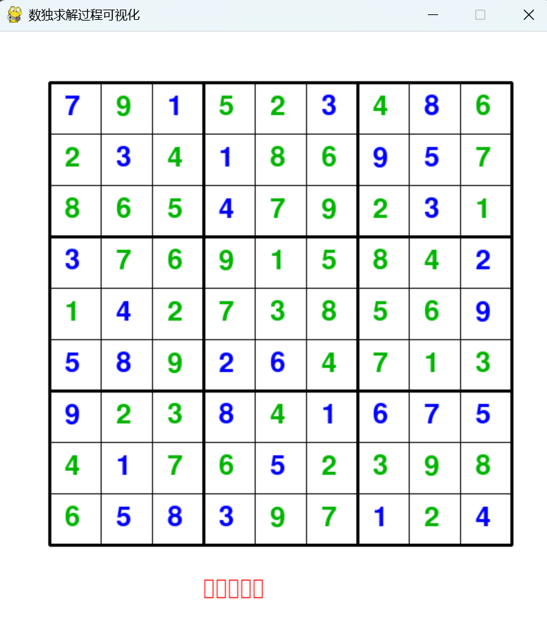

# SudokuSolver — 数独生成与求解可视化工具

## 📌 项目背景
本项目面向「数算B」课程大作业，旨在实现一个**可生成随机可解数独**并进行**逐步求解可视化**的工具。
通过动态展示回溯法的填数过程，帮助理解递归回溯算法的执行流程。

## 🧠 核心算法

### 1. 回溯法生成完整数独
- 从左上角单元格开始，依次尝试 1-9 的随机排列
- 每次填入前检查行、列、3×3 宫的合法性
- 若某位置 9 个数字均冲突，回溯到上一个位置重新尝试
- 时间复杂度：最坏 O(9^(n²))，但由于剪枝实际远快于此

### 2. 挖空法生成谜题
- 在完整数独上随机挖除 40-60 个数字
- 通过再次回溯求解验证唯一解

### 3. 可视化回溯过程
- 使用 Pygame 逐帧渲染每一步填入/回溯操作
- 不同颜色区分：蓝色=原题、红色=正在填入、绿色=已确认

## 🚀 运行指南

### 环境要求
- Python 3.8+
- 依赖库：pygame, numpy

### 安装与运行
\`\`\`bash
# 克隆仓库
git clone https://github.com/mhhd131/SudokuSolver.git
cd SudokuSolver

# 安装依赖
pip install -r requirements.txt

# 运行程序
python main.py
\`\`\`

### 操作说明
- 运行后自动生成随机数独谜题
- 程序将自动展示回溯法逐步求解的完整过程
- 红色高亮为当前正在尝试填入的数字
- 关闭窗口退出

## 📂 项目结构
```
SudokuSolver/       
├── src/        
│   ├── generator.py    
│   └── visualizer.py   
├── main.py     
├── requirements.txt        
├── README.md       
├── image.png
├── .gitignore  
└── LICENSE     

```

## 📸 运行截图


## 🤖 AI 工具声明
- 使用 deepseek-v4-pro 辅助生成了 README 模板和 Pygame 框架代码
- 使用 deepseek-v4-pro 帮助构建Github仓库和运用git管理本地代码

## 📄 许可证
本项目采用 MIT License，详见 LICENSE 文件。